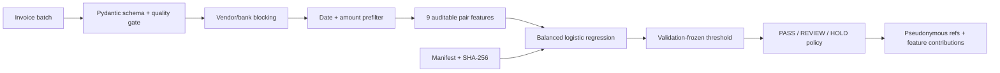

# FaturaIz

**Explainable, cost-aware duplicate-invoice triage for accounts-payable teams**

[](https://github.com/onurozaydin/fatura-iz/actions/workflows/quality.yml)
[](https://www.python.org/)
[](LICENSE)

FaturaIz converts a batch of invoice records into auditable `PASS`, `REVIEW`, or `HOLD`
decisions. It uses blocked candidate generation, an interpretable pairwise model, a
validation-frozen threshold, and a human-review policy. A flag means “inspect these two records,”
never “fraud proved” or “payment automatically rejected.”

> **Data disclosure:** all 4,204 records used for the published training and evaluation run are
> deterministic synthetic scenarios. They represent no real supplier, invoice, person, or business.
> The metrics demonstrate engineering behavior on this generator and must not be treated as expected
> performance on a real accounts-payable ledger.

## Problem and target user

Accounts-payable teams must catch exact resubmissions, punctuation changes, small amount changes,
and altered invoice references without flooding analysts with every legitimate recurring payment.
FaturaIz targets AP operations, internal-control, and finance-platform teams that need a reviewable
control before a payment run.

## Original value and concrete differences

The open-source review included the general-purpose [dedupe](https://github.com/dedupeio/dedupe)
and [RecordLinkage](https://github.com/J535D165/recordlinkage) toolkits, an
[exact-key SQL/n8n workflow](https://github.com/essanss/Duplicate-Invoice-Detection), and a
[rule-based duplicate-payment detector](https://github.com/ayondey47/duplicate-payment-detector).
FaturaIz is an independent implementation and differs in at least five testable ways:

1. **AP-specific decision layer:** probabilities become `PASS`, `REVIEW`, or `HOLD` actions; no
   automated fraud or payment conclusion is made.
2. **Candidate-generation accountability:** blocking recall is measured separately from classifier
   recall, so matching failures cannot be hidden by model metrics.
3. **Leakage-resistant evaluation:** whole synthetic invoice groups are split chronologically into
   70% train, 15% validation, and 15% test partitions before candidate pairs are built.
4. **Frozen precision-aware threshold:** the operating threshold is selected on validation with an
   0.80 precision floor and used unchanged on the untouched test period.
5. **Operational evidence:** exact-rule baseline comparison, duplicate-value capture, estimated
   control cost, feature contributions, PII-safe references, and artifact SHA-256 verification are
   shipped together.

## Architecture



## Verified synthetic-demo results

The committed evidence was regenerated with seed `20260817`. Entire underlying invoice groups are
disjoint across partitions; the final test period contains 950 candidate pairs (90 positive, 860
negative).

| Test metric | FaturaIz | Exact-key baseline |
|---|---:|---:|
| Average precision | **0.9830** | 0.5273 |
| ROC-AUC | **0.9984** | 0.7389 |
| F1 | **0.9727** | 0.6466 |
| Precision | 0.9570 | **1.0000** |
| Recall | **0.9889** | 0.4778 |
| Duplicate-value capture | **99.41%** | 54.71% |

- Candidate blocking recall: **100%** in train, validation, and test on the generated scenarios.
- Frozen threshold: **0.905**, selected only on validation.
- Test errors: **4 false-positive pairs and 1 false-negative pair**.
- The missed pair was a `weak_resubmission`; recall for that slice was **95.65% (22/23)**.
- The cost illustration produced TRY 1,416.48 for FaturaIz versus TRY 93,079.43 for the baseline,
  using full missed-pair exposure plus a configured TRY 50 review cost per false positive. This is
  synthetic arithmetic, not a savings claim or forecast.

Exact values are in [`reports/evaluation.json`](reports/evaluation.json); source-grain and quality
checks are in [`reports/data_quality.json`](reports/data_quality.json).

## Reproducible quick start

Requirements: Python 3.11 or 3.12 and [uv](https://docs.astral.sh/uv/).

```bash
git clone https://github.com/onurozaydin/fatura-iz.git
cd fatura-iz
uv sync --frozen --extra dev
uv run faturaiz train
uv run pytest
uv run uvicorn faturaiz.api:app --host 127.0.0.1 --port 8000
```

Windows PowerShell uses the same `uv` commands. The lock file fixes the full dependency graph.

Score the bundled synthetic sample:

```bash
uv run faturaiz score data/samples/synthetic_invoices.csv
```

## API example

```bash
curl -X POST http://127.0.0.1:8000/v1/triage \
  -H "Content-Type: application/json" \
  --data @data/samples/request.json
```

The response includes pair IDs, a pseudonymous vendor reference, the review state, a risk score,
and the four largest signed feature contributions. Raw vendor identifiers are not returned.

## Data and preparation

- **Source:** generated locally by `src/faturaiz/synthetic.py`; no external or proprietary dataset.
- **License:** generator and generated sample are MIT-licensed with the code.
- **Published run:** 3,600 base groups, 604 labelled resubmissions, 4,204 rows total.
- **Scenarios:** exact copies, formatting shifts, amount shifts, weak resubmissions, and intentionally
  similar legitimate recurring invoices.
- **Preparation:** schema validation, chronological group split, candidate blocking, bounded
  pairwise feature computation, validation-only threshold selection, then one final test evaluation.
- **Committed sample:** 120 rows for API/CLI review. The full dataset is regenerated rather than
  committed, avoiding unnecessary files while preserving exact reproducibility.

## Repository map

```text
src/faturaiz/
├── synthetic.py       # deterministic scenarios and hard negatives
├── candidates.py      # validation, temporal group split, blocking recall
├── features.py        # nine bounded, auditable pair features
├── model.py           # baseline/model evaluation, explanations, artifact integrity
├── policy.py          # PASS / REVIEW / HOLD human-review policy
├── service.py         # privacy-aware orchestration
├── schemas.py         # strict API contracts and limits
├── api.py             # FastAPI boundary
├── training.py        # reproducible end-to-end evidence pipeline
└── cli.py             # train and score commands
```

The model and data cards, architecture rationale, and threat model are under [`docs/`](docs/).

## Engineering quality and security controls

- Type hints, strict MyPy, Ruff lint/format, 25 tests, and **95.21% branch-aware coverage**.
- Python 3.11/3.12 GitHub Actions matrix, deterministic full-training verification on the locked
  Python 3.11 artifact-build runtime, and a container smoke test. Model metrics are stable across
  the supported runtimes, while `joblib` bytes are verified only on the canonical build runtime.
- Strict request schemas, forbidden extra fields, positive/upper-bounded amounts, unique IDs, and a
  500-record request limit.
- Payload contents are not logged; vendor IDs are pseudonymized with a configurable pepper.
- The local `joblib` model is loaded only after its SHA-256 matches the committed manifest. Never
  substitute an untrusted artifact merely because its digest is supplied with it.
- The container runs as a non-root user and is tested read-only with all Linux capabilities dropped.

## Responsible use and limitations

- Synthetic scenarios are simpler than ERP migrations, multilingual OCR noise, supplier mergers,
  credit notes, tax corrections, and collusive behavior.
- Perfect blocking recall is measured only on the configured generator. A real deployment must label
  and measure candidates missed before classification.
- Probabilities are not calibrated for a real ledger; amounts and the TRY 50 review-cost assumption
  are illustrative.
- Similar legitimate recurring invoices caused false positives, while one weak resubmission was
  missed. Human review and existing approval controls remain mandatory.
- Vendor IDs and bank fingerprints may be commercially sensitive even when not personal data. Use
  access controls, retention limits, audit logs, and a secret production pepper.
- Before use: obtain legally sourced historical decisions, define duplicate policy with finance and
  audit owners, perform temporal/vendor holdouts, calibrate probabilities and costs, run shadow mode,
  and monitor candidate recall, review load, drift, and analyst overrides.

## License

Code and generated synthetic sample are released under the [MIT License](LICENSE).
